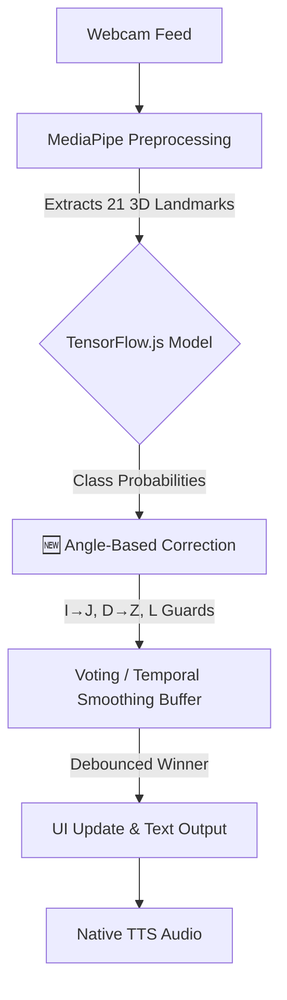
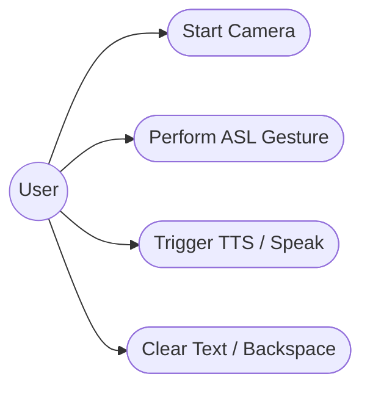

# ASL Translator — Real-Time Sign Language Web App

## 📝 Project Overview
The **ASL Translator** is a fully browser-based, real-time American Sign Language (ASL) alphabet translator. Utilizing computer vision and a custom-trained neural network, the application detects hand landmarks through your webcam and translates gestures into text. Designed with accessibility and user experience in mind, this application operates securely within the browser with no server-side processing required for inference.

## ✨ Key Features
- **Real-time ASL Alphabet Detection:** Instantaneous gesture recognition for all 26 letters of the English alphabet, plus control commands (`space`, `del`, `nothing`).
- **🆕 Angle-Based Letter Correction:** Advanced post-processing that distinguishes visually similar letters (I/J, D/Z) by analyzing finger angles, without requiring model retraining.
- **Temporal Smoothing (Debouncing):** Incorporates a strict voting buffer and a 2-second stability threshold to eliminate flickering and ensure deliberate text input (Auto-typing).
- **Left-hand Mirroring Support:** Automatically detects physical left hands and mirrors the coordinate space on the X-axis, enabling seamless recognition regardless of which hand the user signs with.
- **Native Text-to-Speech (TTS):** Converts constructed sentences to audible speech using the browser's native SpeechSynthesis API.
- **Immersive Custom Text Input:** Features a read-only text output box with a persistent native blinking cursor, blocking physical keyboard input to enforce purely gesture-based interactions.

## 🛠️ Tech Stack
- **HTML5 & CSS3** (Vanilla, custom UI/UX)
- **Vanilla JavaScript** (ES6+)
- **MediaPipe Hands** (For high-performance, real-time hand landmark extraction)
- **TensorFlow.js** (For running the custom MLP neural network model entirely in the browser)

---

## 🏛️ System Architecture Diagrams

### Data Pipeline Flowchart
The following diagram illustrates the frame-by-frame data processing pipeline, from the webcam feed down to the User Interface output:



### User Interaction Use Case
This diagram highlights the primary interaction paths for a standard user:



---

## 🔍 Angle-Based Letter Correction

### Problem Statement
Beberapa huruf ASL memiliki bentuk tangan yang sangat mirip dan hanya berbeda pada **kemiringan jari tertentu**:
- **I vs J**: Bentuk identik, hanya beda kemiringan jari kelingking
- **D vs Z**: Bentuk sangat mirip, hanya beda kemiringan jari telunjuk
- **L confusion**: Huruf T dan Z sering salah terbaca sebagai L

### Solution
Sistem ini menggunakan **post-processing berbasis geometri** untuk menganalisis sudut kemiringan jari dari MediaPipe landmarks dan mengoreksi prediksi model tanpa perlu retrain.

### Correction Rules

| Rule | Condition | Action |
|------|-----------|--------|
| **I → J** | Model prediksi `I` + pinky angle ≥ 50° | Ubah ke `J` |
| **D → Z** | Model prediksi `D` + index angle ≥ 50° | Ubah ke `Z` |
| **L → Z** | Model prediksi `L` + index angle ≥ 45° | Ubah ke `Z` |

**Catatan:** Aturan L → T telah dihapus karena menyebabkan false positive. Model sudah cukup baik membedakan L dan T tanpa koreksi sudut.

### How It Works
```javascript
// Setelah model prediksi
const correctedClass = AngleDetectorModule.correctPrediction(
    predictedClass,
    landmarks,
    confidence
);
```

### Tuning Parameters
Jika akurasi kurang optimal, Anda bisa menyesuaikan threshold di `js/angleDetector.js`. Lihat **[ANGLE_DETECTION_GUIDE.md](ANGLE_DETECTION_GUIDE.md)** untuk panduan lengkap.

### Benefits
✅ Tidak perlu retrain model  
✅ Tidak mengubah arsitektur (tetap single-frame MLP)  
✅ Real-time, tanpa latency tambahan  
✅ Mudah di-tuning sesuai kebutuhan  

---

## 🚀 Setup Instructions

Because this application relies on a `.json` model file and `.bin` shards loaded dynamically via JavaScript, it **must** be served over HTTP/HTTPS rather than via the local file system (`file://` protocol) to prevent CORS issues.

1. **Clone or Download the Repository:**
   Extract the project files to your local machine.

2. **Install a Local Web Server:**
   You can use the **Live Server** extension in VS Code, or a simple Python/Node server.
   
   *Using VS Code Live Server:*
   - Open the project folder in VS Code.
   - Install the "Live Server" extension by Ritwick Dey.
   - Right-click `index.html` and select **"Open with Live Server"**.

   *Using Python:*
   - Open your terminal and navigate to the project root directory.
   - Run: `python -m http.server 8000` (or `python3 -m http.server 8000`)
   - Open your browser and navigate to `http://localhost:8000`.

3. **Grant Camera Permissions:**
   When the web app opens, click **"Start Camera"** and allow browser permissions to access your webcam.

4. **Start Signing!**
   Hold your hand up to the camera, wait 2 seconds for the gesture to stabilize, and begin building words!
